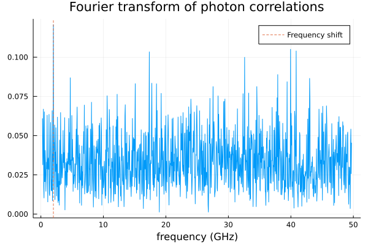

- Photon count is acquired via the following:
  - The intensity is broken up into time bins.
  - Time dependent intensity is normalized by the expected photon counts during the measurement time
  - Generate number of photon counts in each bin by treating the normalized intensity as the average photon count 
  - 

|             <u>Description</u>              | <u>Value</u> |
| :-----------------------------------------: | :----------: |
|               Number of atoms               |     100      |
|                  $\sigma$                   |  13.84 GHz   |
|                  $\Delta$                   |   2.0 GHz    |
|                   $\nu_0$                   | 456.811 THz  |
|       Expected counts per measurement       |      10      |
|            Total expected counts            |    50000     |
|            Length of measurement            |    20 ns     |
|               Time resolution               |    10 ps     |
| Re-instantiate E-field in each measurement? |      No      |

- The actual measurement goes like

$$
E(t) = \sum_{n=1}^N\sum_{m=1}^M
$$

